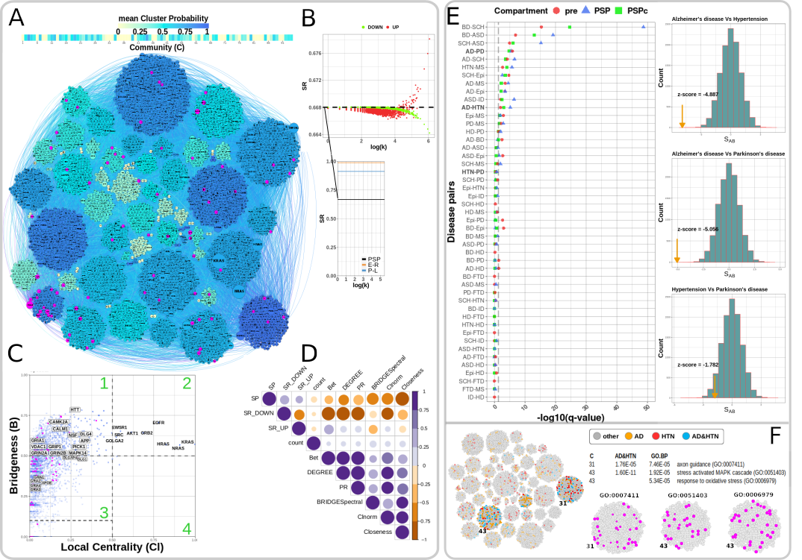

# Human_synaptosome_05_08_2020

Network analysis code for the published paper: Sorokina, O., Mclean, C., Croning, M.D.R. et al. A unified resource and configurable
model of the synapse proteome and its role in disease. Sci Rep 11, 9967 (2021).

  
  <!--  -->

